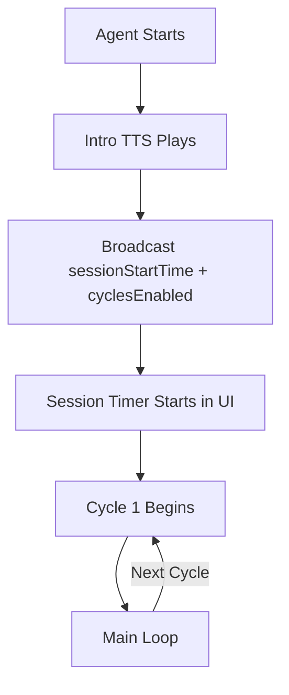
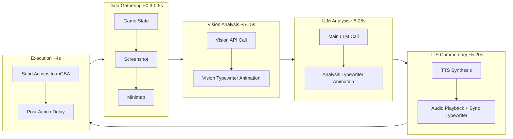

# Stream Cycle: Flow & Timing Documentation

This document describes the main agent cycle as it relates to the **livestream** experience, focusing on visual pacing and engagement.

## Session Lifecycle



### Session Timer

- **Backend**: Broadcasts `sessionStartTime` (Unix ms) after intro TTS completes
- **UI**: `SessionTimer` component displays total game time in `h:m:s` format
- **Ticks**: Every 1 second
- **Location**: `pokemon-ui/src/components/layout/PokemonStreamOverlay.tsx`

### Cycle Timer

- **Starts**: Only when `cyclesEnabled: true` is broadcast (after intro)
- **Resets**: When cycle number increments
- **Ticks**: Every 0.1 seconds
- **Location**: `LiveCycleTimer` component in same file

## Cycle Overview



## Detailed Timing Breakdown

| Component     | Operation               | Typical Time | Timeout          | Log Marker                  |
| ------------- | ----------------------- | ------------ | ---------------- | --------------------------- |
| **mGBA**      | `prep_llm()` game state | 0.3-0.5s     | 30s              | `⏱️ mGBA Response: X.XXs`   |
| **Vision**    | MCP analyze_image       | 5-15s        | Retries forever  | `⏱️ Vision Analysis: X.XXs` |
| **LLM**       | Z.AI chat/completions   | 5-25s        | 40s (+3 retries) | `cycle_metrics["llm"]`      |
| **TTS Synth** | ComfyUI generation      | 5-15s        | 10s              | `🔊 TTS Synthesis complete` |
| **TTS Play**  | Audio playback          | 4-20s        | None             | `🔊 TTS COMPLETE`           |
| **Action**    | Post-action delay       | 4s fixed     | None             | N/A                         |
| **Chat TTS**  | Queue + synthesis       | 3-8s         | Queue max=2      | `⏳ TTS queue full (2/2)`   |

**Total cycle time: 25-75 seconds** (varies by LLM speed and network)

## TTS Queue System

```
MAX_QUEUE_SIZE = 2  (1 commentary + 1 chat response max)

Priority System:
- PRIORITY_COMMENTARY = 100 (highest, plays immediately)
- PRIORITY_CHAT_RESPONSE = 50 (queued, non-blocking)

Non-Blocking Chat TTS:
- Uses queue_and_start_synthesis() not synthesize_and_play()
- If queue full: response shows in UI, skips TTS
- Text fallback: Twitch chat always gets the response
```

## Cycle Metrics Broadcast

Every cycle broadcasts these timing metrics to the UI:

```json
{
  "cycleTiming": "40.2s | wait 2.0s",
  "currentCycleTime": 40.2,
  "prevCycleTime": 35.1,
  "avgCycleTime": 37.5,
  "cycleMetrics": {
    "mGBA": 0.4,
    "vision": 8.3,
    "diff": 0,
    "llm": 15.2,
    "total": 40.2
  }
}
```

## Retry Logic

| Service     | Retries  | Backoff         | Triggered By                      |
| ----------- | -------- | --------------- | --------------------------------- |
| Z.AI LLM    | 3        | 0.5s → 1s → 2s  | RemoteProtocolError, ConnectError |
| Vision MCP  | Infinite | Restarts server | Any failure                       |
| mGBA Socket | N/A      | 35s timeout     | Connection issues                 |

## Log Markers for Debugging

```bash
# Key timing logs to watch:
📡 prep_llm DONE: total=X.XXs     # mGBA response time
⏱️ Vision Analysis: X.XXs         # Vision processing
⏱️ mGBA Response: X.XXs           # Game state fetch
🔊 TTS COMPLETE: synthesis=X.XXs, playback=X.XXs, total=X.XXs
⏱️ Total Cycle Time: X.XXs        # Full wall-clock cycle
⏳ TTS queue full (2/2), skipping  # Queue overflow

# Z.AI retry logs:
ZAI connection error (attempt 1/3): ... Retrying in 0.5s...
ZAI connection failed after 3 attempts: ...
```

## Cycle Steps with Timing

| Step | What Happens               | Broadcast                         | UI Animation                          | Duration         |
| ---- | -------------------------- | --------------------------------- | ------------------------------------- | ---------------- |
| 1    | `prep_llm()` gathers state | `gameState`                       | None                                  | ~0.3-0.5s        |
| 2    | Screenshot captured        | `screenshot_base64`               | Image appears in vision box           | Instant          |
| 3    | Vision API called          | `processingStatus: ANALYZING`     | Waiting dots animate                  | ~5-15s           |
| 4    | Vision result received     | `vision_log`                      | Typewriter animation                  | Duration of text |
| 5    | Main LLM called            | `processingStatus: THINKING`      | Status update                         | ~5-25s           |
| 6    | LLM result received        | `response_log`                    | Typewriter animation                  | Duration of text |
| 7    | TTS synthesis + playback   | `tts_commentary`                  | Commentary typewriter synced to audio | 5-20s            |
| 8    | Actions extracted & sent   | `recentActions`, `action_execute` | Button list updates + flash           | ~0.5s + 4s delay |
| 9    | Save game state            | —                                 | None                                  | ~0.1s            |
| 10   | Chat wait loop             | —                                 | Process Twitch messages               | 2-10s            |

## Stream Engagement Points

| Phase            | What's Engaging                         | What's Idle             |
| ---------------- | --------------------------------------- | ----------------------- |
| Vision Analysis  | Screenshot appears, typewriter animates | —                       |
| LLM Thinking     | —                                       | **5-25s of waiting** ⚠️ |
| Commentary       | TTS audio, typewriter synced            | —                       |
| Action Execution | Buttons update + flash                  | Quick, not very visual  |

## Related Files

- [core/llmdriver.py](../core/llmdriver.py) - `run_auto_loop()` main cycle
- [core/llm_controller.py](../core/llm_controller.py) - LLM calls with retry logic
- [services/websocket_service.py](../services/websocket_service.py) - State broadcasting
- [services/comfyui_tts_service.py](../services/comfyui_tts_service.py) - TTS with queue system
- [pokemon-ui/src/App.tsx](../pokemon-ui/src/App.tsx) - WebSocket consumer
- [pokemon-ui/src/components/layout/PokemonStreamOverlay.tsx](../pokemon-ui/src/components/layout/PokemonStreamOverlay.tsx) - SessionTimer, LiveCycleTimer
