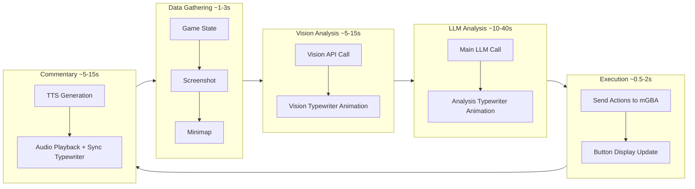

# Stream Cycle: Flow & Timing Documentation

This document describes the main agent cycle as it relates to the **livestream** experience, focusing on visual pacing and engagement.

## Cycle Overview

## Cycle Steps with Timing

| Step | What Happens                | Broadcast                     | UI Animation                          | Duration           |
| ---- | --------------------------- | ----------------------------- | ------------------------------------- | ------------------ |
| 1    | `prep_llm()` gathers state  | `gameState`                   | None                                  | ~1-3s              |
| 2    | Screenshot captured         | `screenshot_base64`           | Image appears in vision box           | Instant            |
| 3    | Vision API called           | `processingStatus: ANALYZING` | Waiting dots animate                  | ~5-15s             |
| 4    | Vision result received      | `vision_log`                  | Typewriter animation                  | Duration of text   |
| 5    | Main LLM called             | `processingStatus: THINKING`  | Status update                         | ~10-40s            |
| 6    | LLM result received         | `response_log`                | Typewriter animation                  | Duration of text   |
| 7    | Actions extracted & sent    | `recentActions`               | Button list updates                   | ~0.5-2s            |
| 8    | TTS queued                  | —                             | None                                  | ~2-5s (generation) |
| 9    | TTS playback starts         | `tts_commentary`              | Commentary typewriter synced to audio | Audio duration     |
| 10   | Twitch responses (optional) | —                             | Additional TTS                        | ~3-10s each        |

**Total cycle time: 25-75 seconds** (varies by LLM speed and network)

## Stream Engagement Points

| Phase            | What's Engaging                         | What's Idle              |
| ---------------- | --------------------------------------- | ------------------------ |
| Vision Analysis  | Screenshot appears, typewriter animates | —                        |
| LLM Thinking     | —                                       | **10-40s of waiting** ⚠️ |
| Action Execution | Buttons update                          | Quick, not very visual   |
| Commentary       | TTS audio, typewriter synced            | —                        |

## Known Gaps

### 1. Button Flash Animation

- **Current:** Buttons shown as static list after actions sent
- **Desired:** Each button flashes/highlights as it's pressed
- **Location:** `pokemon-ui/src/components/units/RecentActions.tsx`

### 2. Twitch Response Interleaving

- **Current:** Twitch responses after main cycle completes
- **Desired:** AI responds to chat DURING the LLM wait time
- **Location:** Response logic in `llmdriver.py` lines ~2200-2400

### 3. LLM Wait Dead Time

- **Current:** Only "THINKING..." status shown
- **Desired:** More visual activity (avatar animation, past memories cycling, etc.)
- **Option:** Use `avatarState` to show thinking animation

## Related Files

- [core/llmdriver.py](../core/llmdriver.py) - `run_auto_loop()` main cycle
- [services/websocket_service.py](../services/websocket_service.py) - State broadcasting
- [services/comfyui_tts_service.py](../services/comfyui_tts_service.py) - TTS with playback callback
- [pokemon-ui/src/App.tsx](../pokemon-ui/src/App.tsx) - WebSocket consumer
- [pokemon-ui/src/components/analysis/LogEntry.tsx](../pokemon-ui/src/components/analysis/LogEntry.tsx) - Typewriter animations
