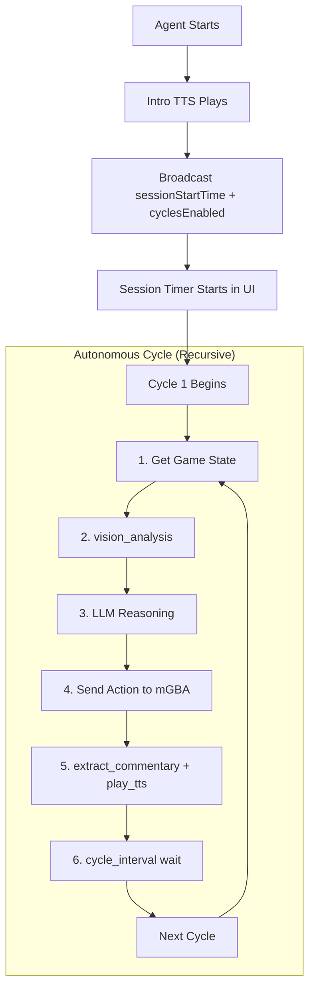

# Stream Cycle: Flow & Timing Documentation

This document describes the main agent cycle as it relates to the **livestream** experience, focusing on visual pacing and engagement.

## Session Lifecycle



## Cycle Overview

Each turn (cycle) takes approximately **15-20 seconds** total, providing a balance between game progress and viewer readability.

### Detailed Timing Breakdown

| Step | Operation | Timing | Visual Impact |
| :--- | :--- | :--- | :--- |
| **1** | **mGBA State Dump** | ~500ms | UI state values update |
| **2** | **Vision Analysis** | ~1-2s | "Vision" panel updates in UI |
| **3** | **LLM Reasoning** | ~3-5s | "Thought Process" scrolls in UI |
| **4** | **Action Output** | ~500ms | Buttons light up on overlay |
| **5** | **TTS Playback** | ~2-5s | Character avatar speaks |
| **6** | **Idle/Wait** | ~5-10s | Buffer for viewer reaction |

## TTS Queue System

The agent uses a **queue-based TTS system** to ensure commentary doesn't overlap and follows the game flow.

1.  **Extraction**: The `llmdriver.py` extracts Section 11 from the LLM response.
2.  **Generation**: The text is sent to the `comfyui_tts_service`.
3.  **Playback**: The audio plays while the character avatar switches to the `speech` pose.
4.  **Sync**: UI receives a `tts_commentary` event via WebSocket to sync the mouth animation.

## Cycle Metrics Broadcast

At the end of every cycle, the agent calculates performance metrics and broadcasts them to the UI:

```json
{
  "type": "cycle_metrics",
  "data": {
    "cycle_time": 18.4,
    "avg_cycle_time": 17.2,
    "total_actions": 450,
    "tokens_per_cycle": 1200
  }
}
```

## Retry Logic

If the LLM fails to provide a valid action or the game state read fails, the system implements an **Exponential Backoff**:
1.  **Retry 1**: 2s delay
2.  **Retry 2**: 5s delay
3.  **Retry 3**: 10s delay + Force Reset of Lua socket

## Log Markers for Debugging

For developers, the stream cycle provides detailed log markers to identify bottlenecks:
- `[PERF] Game state read: 0.45s`
- `[PERF] Vision analysis: 1.1s`
- `[PERF] LLM completion: 4.2s`

## Related Files

- [core/llmdriver.py](../api/core.md#core.llmdriver) - `run_auto_loop()` main cycle
- [core/llm_controller.py](../api/core.md#core.llm_controller) - LLM calls with retry logic
- [services/websocket_service.py](../api/services.md#services.websocket_service) - State broadcasting
- [services/comfyui_tts_service.py](../api/services.md#services.comfyui_tts_service) - TTS with queue system
- **Frontend Source**:
    - `apps/livestream/src/App.tsx` - WebSocket consumer
    - `apps/livestream/src/components/layout/PokemonStreamOverlay.tsx` - SessionTimer, LiveCycleTimer
