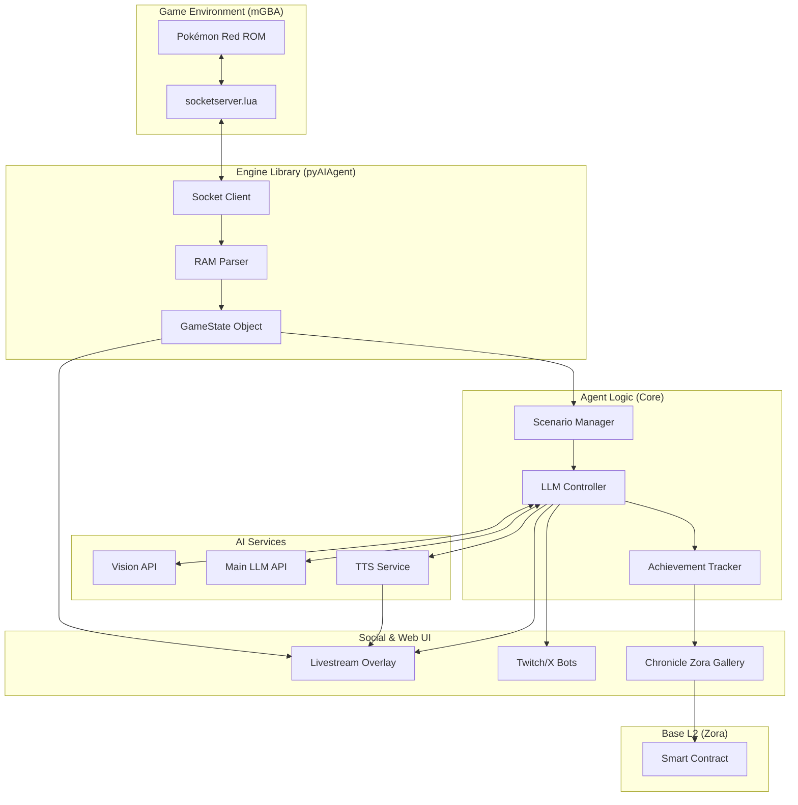

# Architecture Overview

This document describes the high-level architecture of the Pokemon LLM agent.

## System Architecture



## Data Flow

### 1. Game State Collection (mGBA → Python)

```
mGBA Emulator
    ↓ (socketserver.lua)
Socket Commands: SCREENSHOT, MAP, LOCATION, PARTY, etc.
    ↓ (pyAIAgent/utils/socket_utils.py)
Python State Object
    ↓ (pyAIAgent/game/state.py)
Structured Game State Dict
```

### 2. LLM Processing (Python)

```
Game State + Screenshot + Memory Context
    ↓ (core/llmdriver.py)
Vision Analysis (Z.AI MCP or fallback)
    ↓
System Prompt + Screen-Specific Prompt
    ↓
LLM API Call (Gemini, OpenAI, Z.AI, etc.)
    ↓
12-Section Analysis Response
    ↓
Action Extraction + Memory Write
```

### 3. Action Execution (Python → mGBA)

```
Parsed Action String (e.g., "R;R;R;A;")
    ↓ (core/llmdriver.py)
Individual Button Commands
    ↓ (socket_utils.py)
mGBA Lua Script
    ↓
Game Input
```

### 4. UI Updates (Python → React)

```
Game State + Analysis + TTS
    ↓ (services/websocket_service.py)
WebSocket JSON Message
    ↓ (apps/livestream/src/App.tsx)
React State Update
    ↓
Component Re-render
```

## Core Components

### Python Backend

| Module                            | Responsibility                         |
| --------------------------------- | -------------------------------------- |
| `run.py`                          | Main entry point, async orchestration  |
| `core/llmdriver.py`               | LLM interaction loop, action execution |
| `core/prompts/`                   | System prompts, 12-section format      |
| `core/battle_strategy.py`         | Battle decision logic                  |
| `pyAIAgent/game/state.py`         | RAM reading, game state parsing        |
| `core/memory/manager.py`          | Persistent memory, quest tracking      |
| `services/comfyui_tts_service.py` | Text-to-speech generation              |
| `services/websocket_service.py`   | Real-time UI updates                   |

### React Frontend

| Component              | Purpose                           |
| ---------------------- | --------------------------------- |
| `PokemonStreamOverlay` | Main layout, column structure     |
| `AnalysisPanel`        | LLM analysis display, vision info |
| `PokemonTeamBar`       | Party display, minimap            |
| `PokemonCard`          | Individual Pokemon stats          |
| `RecentActions`        | Action history visualization      |

### Lua Script

| File               | Purpose                                            |
| ------------------ | -------------------------------------------------- |
| `socketserver.lua` | mGBA socket server, RAM access, screenshot capture |

## Communication Protocols

### Socket Commands (Python ↔ mGBA)

| Command        | Direction    | Description           |
| -------------- | ------------ | --------------------- |
| `SCREENSHOT`   | Python → Lua | Capture current frame |
| `MAP`          | Python → Lua | Get minimap data      |
| `LOCATION`     | Python → Lua | Get player position   |
| `PARTY`        | Python → Lua | Get party data        |
| `BUTTON:{key}` | Python → Lua | Send button press     |
| `SAVESTATE`    | Python → Lua | Save game state       |
| `LOADSTATE`    | Python → Lua | Load game state       |

### WebSocket Messages (Python ↔ React)

```typescript
interface GameStateMessage {
  type: "game_state";
  data: {
    cycle: number;
    actions: number;
    currentTeam: Pokemon[];
    goals: Goals;
    minimapLocation: string;
    inBattle: boolean;
    // ... see gameTypes.ts
  };
}

interface LogMessage {
  type: "log";
  data: LogEntry;
}

interface TTSMessage {
  type: "tts_commentary";
  data: {
    text: string;
    duration_ms: number;
    playing: boolean;
  };
}
```

## Memory & Persistence

### Runtime Files

| File                      | Purpose                               |
| ------------------------- | ------------------------------------- |
| `data/pokemon_memories.json` | Spatial, gameplay, narrative memories |
| `pokemon_runs.db`         | SQLite run metadata                   |
| `roms/*.ss1`              | Save states                           |

### Memory Types

```python
# From core/memory/manager.py
SpatialMemory   # Exits, landmarks, navigation
GameplayMemory  # Battles, items, events
NarrativeMemory # Story, choices, mistakes
QuestMemory     # Active quests, objectives
```

## LLM Analysis Format

The agent uses a standardized 12-section format across all screen types:

1. **STRATEGY** - Current approach
2. **TARGET** - Destination with coordinates
3. **OBSTACLE** - What's blocking progress
4. **STUCK CHECK** - Movement verification
5. **VISION** - Visual observations
6. **STATE** - Game state facts
7. **MINIMAP/MOVES/CONTEXT** - Screen-specific data
8. **ACTION** - Button presses
9. **REASONING** - Path explanation
10. **ALTERNATIVES** - Backup plan
11. **COMMENTARY** - Stream personality (extracted for TTS)
12. **MEMORY_WRITE** - Events to save to memory

See [Prompt Reference](../reference/PROMPTS.md) for full prompt definitions.
