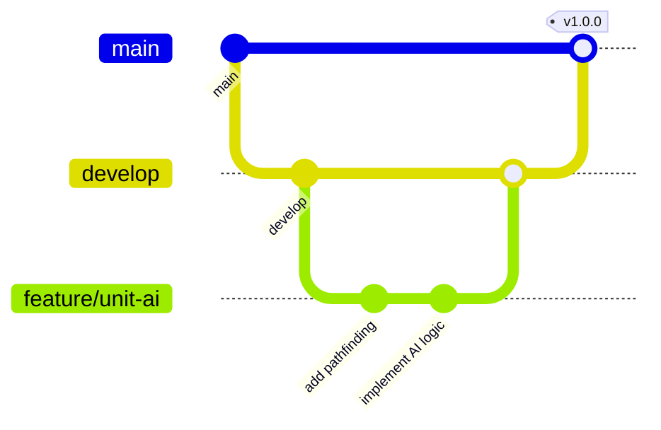

# Fire Emblem AI Architecture

## Project Structure

```
fe-gba/
├── agent/                      # Core AI stack
│   ├── game/                   # FE8 data + state
│   │   ├── fe_data.py          # FE8 data structures
│   │   ├── fe_state.py         # Game state management
│   │   └── story_tracker.py    # Story/phase tracking for Chronicle
│   ├── rl/                     # DQN training + policies
│   ├── llm/                    # LLM orchestration (placeholders today)
│   └── utils/                  # Shared helpers
│       ├── image_utils.py      # Screenshot capture
│       ├── socket_utils.py     # Emulator communication
│       └── file_utils.py       # File operations
├── fe-client/                  # React + Vite web UI
│   ├── src/components          # Core views/widgets
│   ├── src/types               # Shared types
│   └── vite.config.ts          # Vite config
├── roms/                       # Local ROMs/saves (ignored)
├── llmdriver.py                # LLM integration driver
├── run.py                      # Runtime entry point
├── config.py                   # Config + env
├── prompts.py                  # Baseline prompts
├── prompts_improved.py         # Enhanced prompt system (KB-driven)
└── websocket_service.py        # WebSocket server
```

## Git Branching Strategy

### Branch Types

#### 1. **main** (Production)
- Protected branch
- Contains stable, production-ready code
- Only accepts merges from `develop` via PR
- Tagged releases created from this branch
- Deployment triggers from this branch

#### 2. **develop** (Integration)
- Protected branch
- Integration branch for features
- All feature branches merge here first
- Continuous integration runs here
- Must pass all tests before merging to main

#### 3. **feature/** (Feature Development)
- Created from: `develop`
- Merge back to: `develop`
- Naming: `feature/description-of-feature`
- Examples:
  - `feature/unit-movement-ai`
  - `feature/combat-forecast-ui`
  - `feature/chapter-objectives`
- Deleted after merge

#### 4. **bugfix/** (Bug Fixes)
- Created from: `develop`
- Merge back to: `develop`
- Naming: `bugfix/description-of-fix`
- Examples:
  - `bugfix/memory-leak-units`
  - `bugfix/websocket-reconnect`

#### 5. **hotfix/** (Critical Fixes)
- Created from: `main`
- Merge back to: `main` AND `develop`
- Naming: `hotfix/critical-issue`
- For production emergencies only

#### 6. **release/** (Release Preparation)
- Created from: `develop`
- Merge back to: `main` AND `develop`
- Naming: `release/version-number`
- Example: `release/1.0.0`
- Used for final testing and version bumps

## Workflow

### Feature Development Flow



1. Create feature branch from `develop`
   ```bash
   git checkout develop
   git pull origin develop
   git checkout -b feature/your-feature-name
   ```

2. Develop and commit changes
   ```bash
   git add .
   git commit -m "feat: implement unit movement AI"
   ```

3. Push feature branch
   ```bash
   git push -u origin feature/your-feature-name
   ```

4. Create PR to `develop`
   - Request code review
   - Ensure CI passes
   - Merge via GitHub

5. After testing in `develop`, release to `main`
   ```bash
   git checkout develop
   git pull origin develop
   git checkout -b release/1.0.0
   # Version bumps and final fixes
   git push -u origin release/1.0.0
   ```

### Hotfix Flow

1. Create from `main` for critical fixes
   ```bash
   git checkout main
   git pull origin main
   git checkout -b hotfix/critical-bug
   ```

2. Fix and test
   ```bash
   git commit -m "hotfix: resolve memory corruption"
   git push -u origin hotfix/critical-bug
   ```

3. Merge to both `main` and `develop`
   ```bash
   # Create PR to main
   # After merge, also merge to develop
   git checkout develop
   git merge main
   ```

## Commit Message Convention

### Format
```
<type>(<scope>): <subject>

<body>

<footer>
```

### Types
- **feat**: New feature
- **fix**: Bug fix
- **docs**: Documentation changes
- **style**: Code style changes (formatting, etc)
- **refactor**: Code refactoring
- **test**: Test additions or changes
- **chore**: Build process or auxiliary tool changes
- **perf**: Performance improvements

### Examples
```
feat(ai): implement tactical unit positioning

Add smart positioning system that evaluates:
- Terrain advantages
- Enemy threat ranges
- Support unit proximity

Closes #42
```

```
fix(combat): correct damage calculation for magic units

Magic damage was incorrectly using physical defense
instead of resistance stat.
```

## Code Review Requirements

### Pull Request Checklist
- [ ] Code follows project style guidelines
- [ ] Tests added/updated for changes
- [ ] Documentation updated if needed
- [ ] No console.log or debug code
- [ ] Performance impact considered
- [ ] Security implications reviewed
- [ ] Backward compatibility maintained

### Review Focus Areas

1. **AI Logic**
   - Efficiency of decision making
   - Edge case handling
   - Performance optimization

2. **Game State**
   - Memory address accuracy
   - State synchronization
   - Data validation

3. **UI/UX**
   - Responsive design
   - Accessibility
   - User feedback clarity

4. **Integration**
   - WebSocket stability
   - LLM prompt efficiency
   - Error handling

## Testing Strategy

### Test Types

1. **Unit Tests**
   - Combat calculations
   - Movement validation
   - State management

2. **Integration Tests**
   - Emulator communication
   - WebSocket messaging
   - LLM integration

3. **E2E Tests**
   - Full gameplay scenarios
   - UI interactions
   - Performance benchmarks

### Test Coverage Requirements
- Minimum 80% for critical paths
- 100% for combat calculations
- All edge cases documented

## Performance Guidelines

### Optimization Priorities

1. **LLM Efficiency**
   - Minimize token usage
   - Cache frequent queries
   - Batch state updates

2. **Memory Management**
   - Efficient state storage
   - Cleanup unused references
   - Optimize image processing

3. **Network Optimization**
   - WebSocket message batching
   - Compression for screenshots
   - Reconnection strategies

## Security Considerations

### API Keys & Secrets
- Never commit API keys
- Use environment variables
- Document required secrets in `.env.example`

### Input Validation
- Validate all emulator data
- Sanitize WebSocket messages
- Bounds check memory addresses

### Access Control
- Limit emulator commands
- Validate action sequences
- Rate limit AI requests

## Deployment Pipeline

### Environments

1. **Development**
   - Branch: `develop`
   - Auto-deploy on merge
   - Testing environment

2. **Staging**
   - Branch: `release/*`
   - Pre-production testing
   - Performance validation

3. **Production**
   - Branch: `main`
   - Tagged releases only
   - Monitoring enabled

### CI/CD Steps

1. Lint and format check
2. Run test suite
3. Build application
4. Security scan
5. Deploy to environment
6. Smoke tests
7. Performance monitoring

## Monitoring & Logging

### Key Metrics
- AI decision time
- Memory usage
- WebSocket latency
- Error rates
- Token consumption

### Log Levels
- **ERROR**: System failures
- **WARN**: Degraded performance
- **INFO**: State changes
- **DEBUG**: Detailed execution

## Future Considerations

### Planned Improvements
- Multi-game support (FE6, FE7)
- Advanced AI strategies
- Multiplayer observation
- Training mode
- Speedrun optimization

### Technical Debt
- Migrate deprecated Pokemon code
- Optimize memory reading
- Implement state rollback
- Add replay system

## Resources

### Documentation
- [Fire Emblem 8 Memory Map](docs/fe8-memory.md)
- [AI Strategy Guide](docs/ai-strategy.md)
- [WebSocket Protocol](docs/websocket-protocol.md)

### Tools
- mGBA emulator
- React DevTools
- Chrome Performance Profiler
- Git Flow extensions
