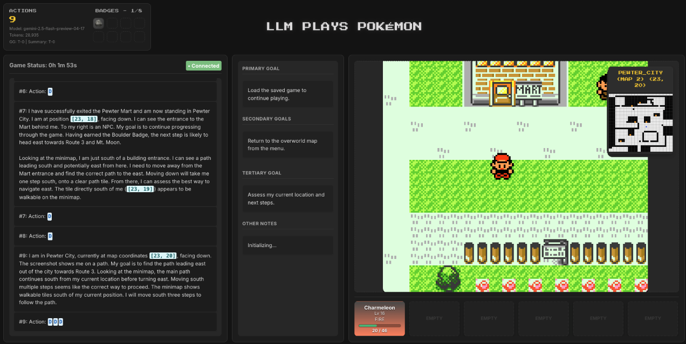
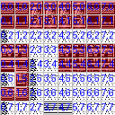
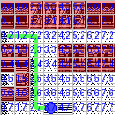
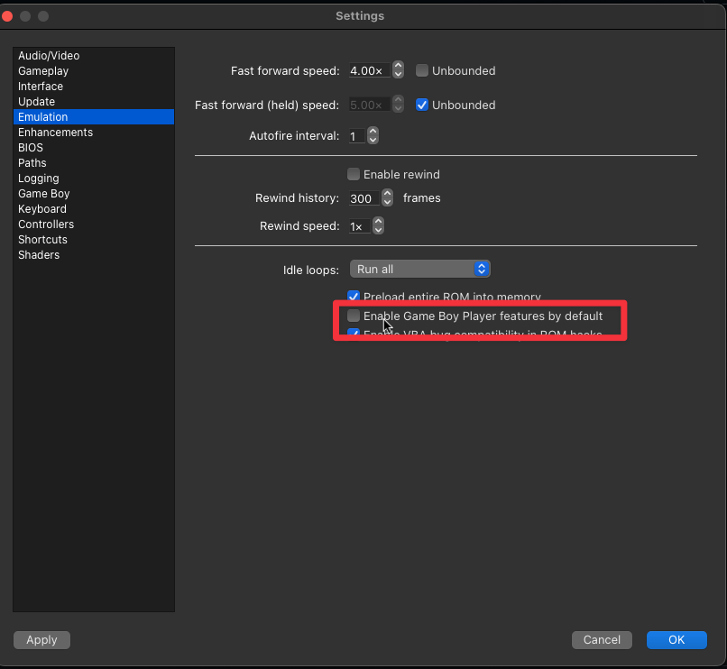

# pokemon-llm

- Currently only supports Gen1 but Gen2 & Gen3 support are planned
- Requires mGBA with scripting autolaunch, [dev builds support this.](https://mgba.io/downloads.html#development-downloads)

## Web UI



> Open web_ui/index.html in your browser. Use streaming software like OBS to add mGBA game feed.

## DUMP MAP IMAGE

python -m tools.map_dumper red.gb 56 -o mart.png -d --start 7,7 --end 0,2

| Normal                          | Debug                          | Path                                | Minimal                          |
| ------------------------------- | ------------------------------ | ----------------------------------- | -------------------------------- |
|  |  |  |  |

## RUN

```bash
# Basic usage with environment variables (ROMs in aroms/ folder)
POKEMON_ROM=firered.gba ZAI_MODEL=glm-4.6 python run.py --mode ZAI --auto

# Or set in .env file and run
python run.py --mode [model-name] [--auto] [--benchmark gymbench.py] [--load_savestate]

# Example directory structure:
# roms/
# ├── firered.gba
# ├── leafgreen.gba
# └── red.gbc
```

If you omit --mode, the program will prompt you to select a mode interactively:

```bash

$ python run.py --auto --benchmark gymbench.py --load_savestate

No LLM mode specified via command line.
Please choose the LLM mode from the list below:
  1. OPENAI
  2. GEMINI
  3. OLLAMA
  4. LMSTUDIO
  5. GROQ
  6. TOGETHER
  7. GROK
  8. ANTHOPIC
  9. ZAI (GLM)
Enter the number of your choice: 1
Great! You selected: OPENAI

```

## Configuration

Copy `.env.example` to `.env` and configure your settings:

```bash
cp .env.example .env
# Edit .env with your API keys and ROM path
```

### ROM Configuration

Place your Pokemon ROM files in the `roms/` folder and configure them via environment variable:

```bash
# Set your ROM file (default: firered.gba, looks in roms/firered.gba)
POKEMON_ROM=firered.gba

# For ROMs in subdirectories or absolute paths:
POKEMON_ROM=subfolder/myrom.gba
POKEMON_ROM=/path/to/roms/firered.gba
```

**Directory Structure:**
```
pokemon-llm/
├── roms/
│   ├── firered.gba
│   ├── leafgreen.gba
│   ├── red.gbc
│   └── blue.gbc
├── .env
└── run.py
```

**Supported ROMs:**
- Pokemon FireRed (`.gba`) - Recommended
- Pokemon LeafGreen (`.gba`)
- Pokemon Red/Blue/Yellow (`.gbc`) - Gen 1 only
- Pokemon Gold/Silver/Crystal (`.gbc`) - Gen 2 only

**Current Support:**
- Gen 1: Fully supported
- Gen 2: Planned support
- Gen 3: FireRed/LeafGreen support in development

### Z.AI (GLM) Provider with MCP Vision Server

The Z.AI provider supports enhanced vision capabilities through the Model Context Protocol (MCP) vision server:

**Features:**
- Vision understanding through dedicated MCP server
- Automatic fallback to direct API if MCP unavailable
- Support for GLM-4V and other vision models

**Setup:**
1. Get your Z.AI API key from [z.ai](https://z.ai)
2. Set environment variables:
   ```bash
   ZAI_API_KEY=your_zai_api_key_here
   ZAI_MODEL=glm-4v
   ZAI_BASE_URL=https://open.bigmodel.cn/api/paas/v4/
   ```
3. Optional: Install Node.js for MCP vision server support
4. Run with: `python run.py --mode ZAI`

**Usage:**
- Images are automatically processed through the MCP vision server
- The server provides enhanced image analysis capabilities
- Falls back to base64 encoding if MCP server unavailable

> Configure mGBA not to use GB Player features.


